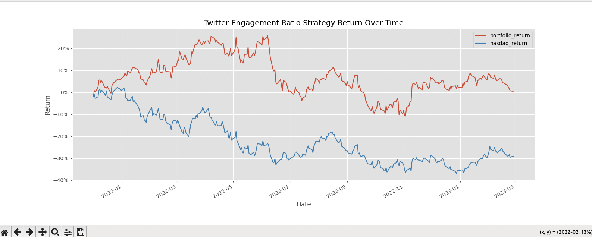

# Twitter Sentiment Analysis Project

## Overview
The Twitter Sentiment Analysis Project is a Python-based project focused on analyzing sentiment data from Twitter. It involves cleaning the data, processing it to calculate engagement ratios of stocks mentioned on Twitter, and visualizing the results over time. This project aims to provide insights into how social media sentiment affects stock market trends.

## Features
1. **Data Cleaning**: Removes rows containing specific keywords or phrases to ensure data accuracy.
2. **Data Processing and Analysis**: Processes sentiment data, calculates engagement ratios, and filters out stocks with low engagement.
3. **Portfolio Construction**: Constructs a portfolio based on top-ranked stocks by engagement ratio.
4. **Performance Evaluation**: Compares the portfolio's performance to a benchmark index (NASDAQ-100) and plots cumulative returns over time.

## Output 


## Installation

1. **Clone the repository**:
    ```bash
    git clone https://github.com/your-username/twitter-sentiment-project.git
    cd twitter-sentiment-project
    ```

2. **Install the required dependencies**:
    ```bash
    pip install pandas numpy matplotlib yfinance
    ```

3. **Run the script**:
    ```bash
    python sentiment_analysis.py
    ```

## Usage

1. **Data Cleaning**:
    - Modify the `input_file_path` and `output_file_path` variables in the script if needed.
    - Run the script to clean the data and save it to the output file.

2. **Data Processing and Analysis**:
    - Ensure the cleaned data file is available.
    - Run the script to process the data, calculate engagement ratios, and filter top-ranked stocks.

3. **Portfolio Construction and Performance Evaluation**:
    - Ensure internet access to download stock price data.
    - Run the script to construct the portfolio, download index data, and visualize cumulative returns.

## Code Structure

- `sentiment_analysis.py`: Main script containing data processing and analysis logic.
- `sentiment_data.csv`: Input file containing the original sentiment data.
- `sentiment_data_new.csv`: Output file containing the cleaned sentiment data.

## Key Dependencies

- `pandas`: For data manipulation and analysis.
- `numpy`: For numerical operations.
- `matplotlib`: For plotting data.
- `yfinance`: For downloading stock price data.

## Contributing

1. **Fork the repository**.
2. **Create a new branch** for your feature or bugfix:
    ```bash
    git checkout -b feature-name
    ```
3. **Commit your changes**:
    ```bash
    git commit -m 'Add some feature'
    ```
4. **Push to the branch**:
    ```bash
    git push origin feature-name
    ```
5. **Create a new Pull Request**.

## Contact
For questions or suggestions, please contact [Aneesh Bukya](mailto:aneeshbsri@outlook.com).
